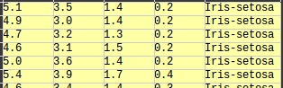

# Project for Programming and Scripting module at GMIT 2019 - Fisher's Iris Data Set

>Author: **Andrzej Kocielski**  
>Github: [andkoc001](https://github.com/andkoc001/)  
>Email: G00376291@gmit.ie

Created: 13-03-2019,
Last update: 17-04-2019  

___

This repository documents my research, project progress (inluding comments for my future reference) and findings to the Fisher's Iris Data Set Project for the Programming and Scripting module, Galway-Mayo Institute of Technology, 2019.  

Lecturer: dr Ian McLoughlin

The detailed Project instructions:
<https://github.com/ianmcloughlin/project-pands/raw/master/project.pdf>  

___

## Project research, excecution and findings

### Research plan (initial, to be developed in due course)

1. Introduction to the project
2. Fisher's iris data set
   1. Origin
   2. Data set
   3. Raw data
   4. Meaning and significance
3. My analysis
   1. Python modules used (Numpy, Pandas, Mathplotlib, Jupyter Notebook)
   2. Program name and where it is reposited
      1. Python program file: iris.py
      2. Jupyter notebook file: PandS_Project_2019
   3. Program execution - manual and instructions
      1. How to run the program
      2. Some key variables - what is what (naming convention)
4. Iris data set analysis and specific findings
   1. General comment
   2. Basic statistical analysis
   3. Data cleance
   4. Data break down and discrimination
   5. Classification, grupping, etc.
   6. Visualisation and interpretation
   7. Pattern analysis
5. Conclusion
   1. General findings
   2. Ideas for further program development
6. References

### Tasks list (or rather just ideas catcher)

Basic statistical information

- [ ] Min and Max value  
- [ ] Average of each column
- [ ] Mean value of each column  
- [ ] Standard diviation

Data discrimination and classification

- [ ] Min and Max value with species discrimination  
- [ ] Average of each column with species discrimination  
- [ ] Mean value of each column with species discrimination
- [ ] Standard diviation of each column

Visualisation and interpretation

- [ ] Histogram
- [ ] Scattered plot

Pattern analysis

___

## 1. Introduction

This project is intened to introduce into data anlysis, on example of the Fisher's Iris data set.

## 2. Fisher's iris data set

### 2.1 Origin

The data set is named after Ronald Fisher, a biologist. He made a significant contribition to development of statistics. The Iris data set is his fameus statistical description of three species of iris flowers. It contains measurements of 50 samples consisting length and width of sepals and petals for each species.

Background of Fisher's Iris data set on Wikipedia page: <https://en.wikipedia.org/wiki/Iris_flower_data_set>, or on Machine Learning Repository of University of California: <https://archive.ics.uci.edu/ml/datasets/iris>.

### 2.2 Iris data set

The data set contains 3 classes (iris species: Iris Setosa, Iris Versicolour, Iris Virginica) of 50 instances each. The classes are described with the following attributes:

1. sepal length in cm,
2. sepal width in cm,
3. petal length in cm,
4. petal width in cm.

### 2.3 Raw data analysis

Raw dataset obtained from: <http://archive.ics.uci.edu/ml/machine-learning-databases/iris/>.

The first few rows look like this:  


A quick review of the raw data in the csv file reveals the following findings:

1. The data set is organised in 5 columns (known as attributes or features) and 150 rows (known as instances).
2. Columns 1 to 4 consist of `float` type numbers (lengths and widths of sepals and petals in cm), whereas 5th column is of `string` type (iris specis).

### 2.3 Meaning and significance of the data set

### 2.4 Python as a tool for data analysis

## 3. Python progam

### 3.1 What, where

The python program file name used to perform some basic data analysis is: **`iris.py`**.

Also, a Jupyter Notebook for the project is created: **`PandS_Project_2019`**.

The program and the Jupyter Notebook are reposited at: <https://github.com/andkoc001/PandS-Project2019>.

### Python libraries and modules

Inside my `irys.py`, after importing `Pandas` package, I include the folling snippet.

### Reading the csv file

```Python
iris_dataset = pandas.read_csv('iris_dataset.csv'))
```

One of the methods of the Pandas package is `.describe()`. It can by called by typing: `data_set.describe()`, where `data_set` is a given name to a `.csv` file.

Next, I apply the `.describe()` method, which shows some information of the data set, like mean, average, etc.

Findings:

- aaaa  
- ...

___

### Loose notes, temporary

From the lecture video, ..., regarding useful numpy methods, let's write:

```Python
data = numpy.genfromtxt('raw_data_file.csv', delimiter=',')
```

then:

```Python
firstcol = data[:,0] # subset containing data
```

and then:

```Python
meanfirstcol = numpy.mean(firstcol) # average of first column
numpy.min(firstcol) # minimum element value
numpy.max(firstcol) # maximum element value
```

To create a histogram:

```Python
import matplotlib.pyplot as pl
pl.hist(firstcol)
pl.show() # NB. it plots **the last*- calculation done
```

To distibute species:

```Python
Species distribution; source <https://machinelearningmastery.com/machine-learning-in-python-step-by-step/>
print(dataset.groupby('class').size())
```

___

Learning about Jupyter Notebook - mostly through YouTube tutorials.
Start Jupyter Notbook by typing in Terminal: `jupyter notebook`.
___
___

## References

### Project and the data set related

- Raw dataset obtained from: <http://archive.ics.uci.edu/ml/machine-learning-databases/iris/>
- Wikipedia page on the Fisher's Iris data set: <https://en.wikipedia.org/wiki/Iris_flower_data_set>

### General Python related

- GMIT Programming and Scripting module materials: <https://learnonline.gmit.ie/course/view.php?id=1588#section-0>
- Python 3 tutorial documentation: <https://docs.python.org/3/tutorial/>
- A Whirlpool Tour of Python by Jake VanderPlas: <https://www.oreilly.com/programming/free/files/a-whirlwind-tour-of-python.pdf>
- The Coder's Apprentice by Pieter Spronock: <http://spronck.net/pythonbook/pythonbook.pdf>
- Python reference: <https://www.w3schools.com/python/python_reference.asp>
- Modules vs Packages vs Libraries in Python: <https://knowpapa.com/modpaclib-py/>
- Python tutorial for beginners: <https://codewithmosh.com>, <https://youtu.be/_uQrJ0TkZlc>
- Stack Overflow forum: <https://stackoverflow.com>
- Python puzzles: <https://blog.finxter.com/>

### Python modules and packages

- Intro to Python packages: <https://data36.com/python-libraries-packages-data-scientists/>
- Anaconda User Guide: <https://docs.anaconda.com/anaconda/user-guide/>
- Matplotlib documentation: <https://matplotlib.org/contents.html>
- 10 Minutes to Pandas: <https://pandas.pydata.org/pandas-docs/stable/getting_started/10min.html>
- Pandas tutorial: <http://www.datasciencemadesimple.com/head-and-tail-in-python-pandas/>
- Pyplot Tutorial: <https://matplotlib.org/users/pyplot_tutorial.html>
- Jupyter documentation: <https://jupyter.org/documentation>
- Jupyter tips and tricks: <https://www.dataquest.io/blog/jupyter-notebook-tips-tricks-shortcuts/>

### Data analysis

- Totorial to data analysis: <https://machinelearningmastery.com/machine-learning-in-python-step-by-step/>
- Data visuaisation in Python: <https://medium.com/python-pandemonium/data-visualization-in-python-line-graph-in-matplotlib-9dfd0016d180>
- Jupyter intro: <https://medium.com/ibm-data-science-experience/back-to-basics-jupyter-notebooks-dfcdc19c54bc>

### Github and Markdown

- An Introduction to Version Control Using GitHub Desktop: <https://programminghistorian.org/en/lessons/getting-started-with-github-desktop>
- Mastering Markdown: <https://guides.github.com/features/mastering-markdown/>
- Markdownlint Rules: <https://github.com/DavidAnson/markdownlint/blob/v0.12.0/doc/Rules.md>
